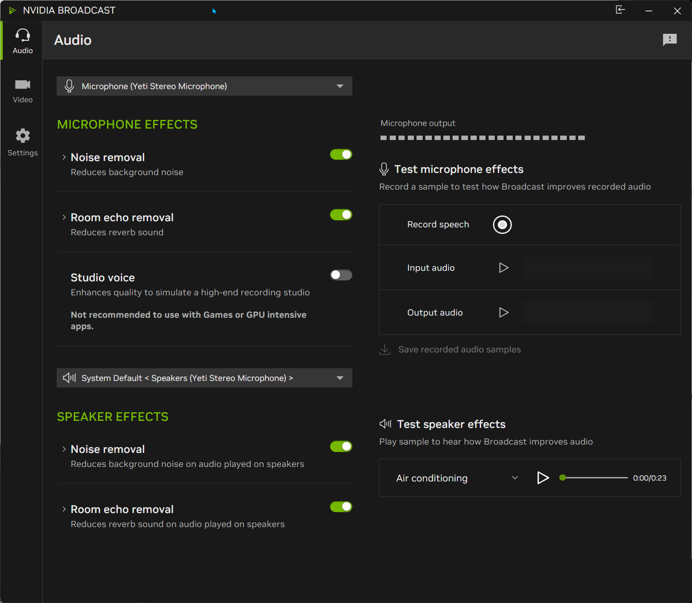
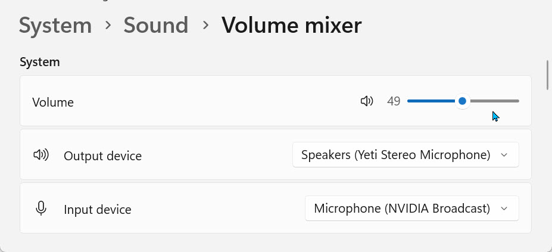
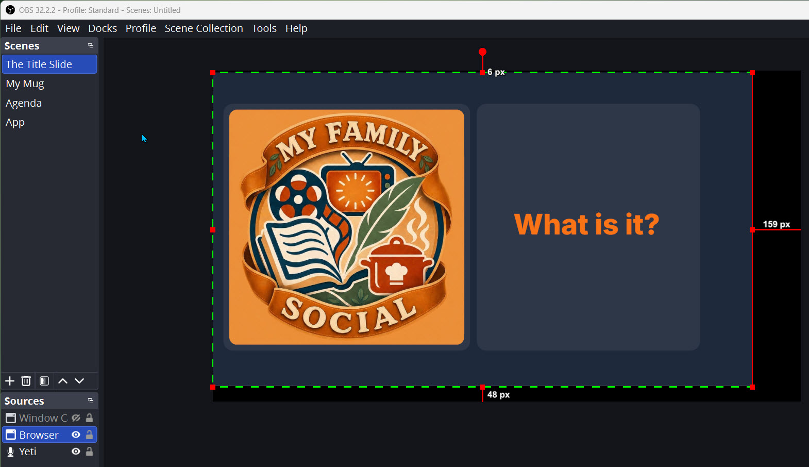
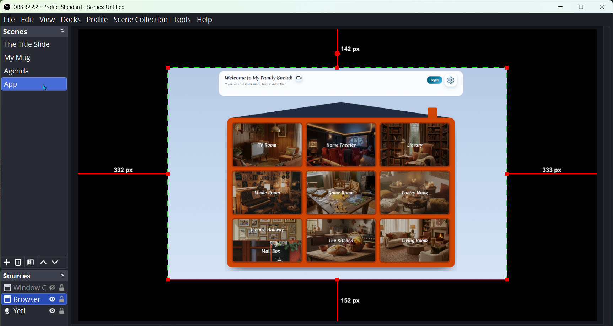
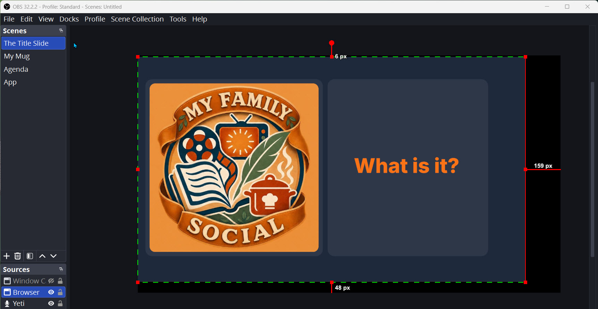
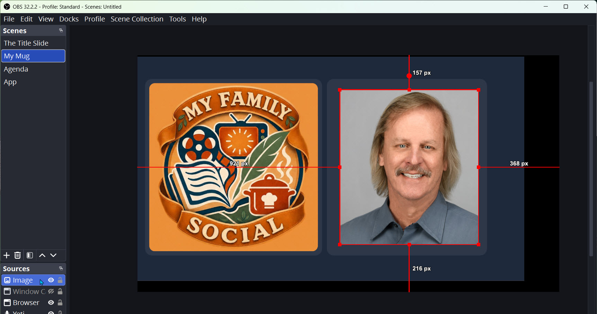
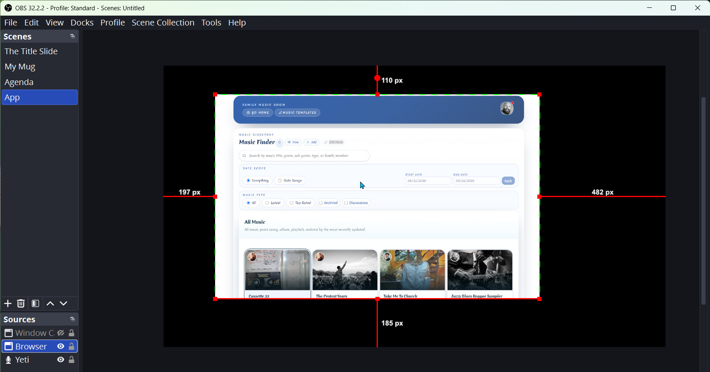

# Overview
There are filters for the microphone, and there are sizing settings for the browser inside the Scenes section of OBS. 

## Microphone filters 
1. The best tool for sound suppression of keyboard clicks and such is the NVIDIA broadcast filters, as shown below.

    

    **Note**: even with the filters in NVIDIA, I noticed that with my headphones there seems to be still a slight reverb, but on the recording it doesn't show up. Ignore that reverb in your headphones. 

2. And make sure the Windows Sound Mixer is referencing the NVIDIA microphone and that the volume is adjusted correctly. 

    

## Browser Sizing
1. Make sure the browser **zoom is at 80%**. 
2. Open the slide deck and launch the play with the speaker notes (then close the speaker notes) 
3. Size the browser window so that it fits within the dimensions inside the browser source of your slide scene.

    

4. In OBS, set up a separate scene for the app recording because I want to make the zoom settings a little bigger for the app so it's more visible. 

    

## OBS Scene Transitions

There are a number of scenes defined in OBS: some for the slides and one for the app. The slide scenes should be sized the same way, but differently than the app, as discussed above. However, when recording, there are transitions defined between the scenes, and these should be used in the recording. 

**Important**: Before recording, make sure that all of the slide scenes are sized exactly the same. If they aren't, then you need to remove the ones that aren't consistent, duplicate the good one, and rename again. **Sizing the browser in those slides can be very painful, that was just easier to duplicate.** 

1. Record **The Title Slide scene** for about 10 seconds, as there will be music added to the first 10 seconds of the audio soundtrack in Shotcut.

    

2. Then click to the My **Mug scene**, which will transition in a mugshot of myself. 

    

3. After a short greeting, then transition to the **Agenda scene**, which will transition from the mugshot to the agenda. 
4. The **App scene** would be used when doing a demo inside of my family social. 

    

